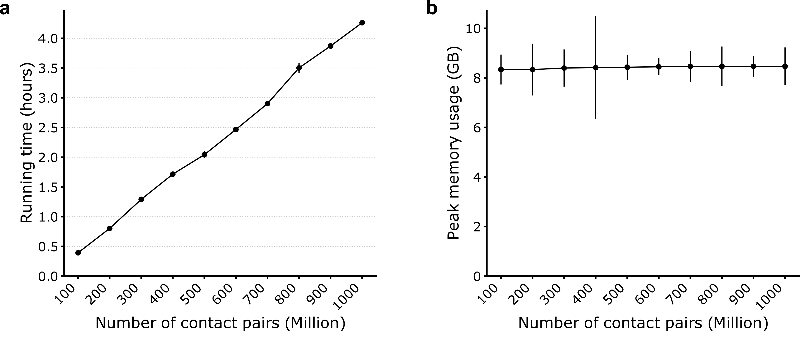
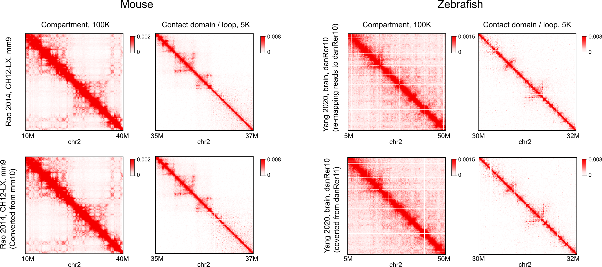

pairLiftOver
============
pairLiftOver is a Python package that converts the two-dimensional genomic coordinates
of chromatin contact pairs between assemblies.

pairLiftOver is based on the `UCSC chain files <https://genome.ucsc.edu/goldenPath/help/chain.html>`_.
It takes a pairs file or matrix file as input, performs coordinate conversion for each contact pair,
and outputs a sorted pairs file or contact matrix with coordinates in another assembly.

Installation
============
pairLiftOver and all the dependencies can be installed through either `conda <https://conda.io/miniconda.html>`_
or `pip <https://pypi.org/project/pip/>`_::

    $ conda config --add channels defaults
    $ conda config --add channels bioconda
    $ conda config --add channels conda-forge
    $ conda create -n pairliftover cooler pairtools kerneltree
    $ conda activate pairliftover
    $ pip install pairLiftOver hic-straw

Data Format
===========
Currently, pairLiftOver supports 4 input data formats: `4DN pairs <https://github.com/4dn-dcic/pairix/blob/master/pairs_format_specification.md>`_,
`allValidPairs <https://nservant.github.io/HiC-Pro/RESULTS.html>`_, `cool <https://open2c.github.io/cooler/>`_,
and `hic <https://github.com/aidenlab/juicer/wiki/Data>`_. It is necessary to provide a pairs file
(`4DN pairs <https://github.com/4dn-dcic/pairix/blob/master/pairs_format_specification.md>`_ or
`allValidPairs <https://nservant.github.io/HiC-Pro/RESULTS.html>`_) to get the most accurate results,
however, when such file is not available, pairLiftOver can also operate on contact matrices binned at kilobase resolutions
(in `cool <https://open2c.github.io/cooler/>`_ or `hic <https://github.com/aidenlab/juicer/wiki/Data>`_ formats).
For hic format, since multiple matrices at various resolutions are stored in a single file, pairLiftOver automatically detects
and reads data from the one at the highest resolution. 

The default output of pairLiftOver is a sorted pairs file in the standard 4DN pairs format,
containing seven columns: “readID”, “chr1”, “pos1”, “chr2”, “pos2”, “strand1”, and “strand2”.
However, you can also choose to output a matrix file in cool or hic format by setting the
parameter ``--output-format``.

Usage
=====
Open a terminal, type ``pairLiftOver -h`` for help information.

Here is an example command which uses a 4DN pairs file in hg19 coordinates as input, and
outputs an mcool file with chromatin contacts in hg38 coordinates::

    $ pairLiftOver --input test.hg19.pairs.gz --input-format pairs --out-pre test-hg38 \
    --output-format cool --out-chromsizes hg38.chrom.sizes --in-assembly hg19 --out-assembly hg38 \
    --logFile pairLiftOver.log

Since the version 0.1.3, pairLiftOver has added a function to perform a pure
format conversion. For example, the following command transforms a contact matrix
from the .cool format to the .hic format, without the coordinate liftover. Note that
the values of ``--in-assembly`` and ``--out-assembly`` need to be the same to turn
on this function::

    $ pairLiftOver --input Rao2014-K562-MboI-allreps-filtered.5kb.cool --input-format cooler \
    --out-pre K562-format-conversion-test --output-format hic --out-chromsizes hg19.chrom.sizes \
    --in-assembly hg19 --out-assembly hg19 --memory 40G

Running time and memory usage
=============================
The running time of pairLiftOver grows linearly with the number of contact pairs. The memory usage can
be roughly controlled by the parameter ``--memory``. In the figure below, pairLiftOver was tested on the
downsampled GM12878 Hi-C datasets (Rao 2014) (ranging from 100 million to 1 billion valid pairs). For each
run, the memory and the number of processes allocated to pairLiftOver were set to 8Gb (``--memory 8G``) and
8 (``--nproc 8``), respectively.

Accuracy
========
So far, pairLiftOver has been tested on datasets of human (Rao 2014, GM12878 and K562), mouse (Rao 2014, CH12-LX)
and zebrafish (Yang 2020, brain tissue). And the matrices obtained by pairLiftOver are nearly identical to the
re-mapping results at various resolutions.

