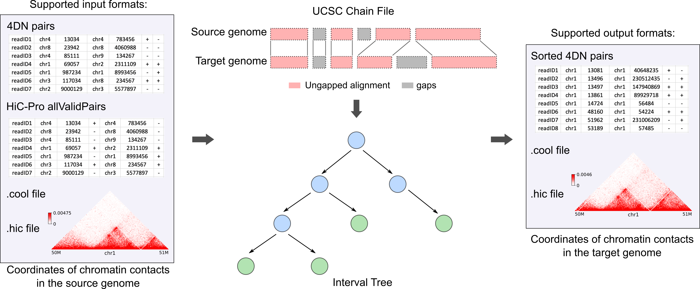

HiCLift 
=======
With the continuous effort to improve the quality of human reference genome and the generation
of more and more personal genomes, the conversion of genomic coordinates between genome assemblies
is critical in many integrative and comparative studies. While tools have been developed for such
task for linear genome signals such as ChIP-Seq, no tool exists to convert genome assemblies for
chromatin interaction data, despite the importance of three-dimensional (3D) genome organization
in gene regulation and disease. Here, we present HiCLift (previously known as pairLiftOver), a
fast and efficient tool that can convert the genomic coordinates of chromatin contacts such as Hi-C
and Micro-C from one assembly to another, including the latest T2T genome. Comparing with the
strategy of directly re-mapping raw reads to a different genome, HiCLift runs on average 42 times
faster (hours vs. days), while outputs nearly identical contact matrices. More importantly, as
HiCLift does not need to re-map the raw reads, it can directly convert human patient sample data,
where the raw sequencing reads are sometimes hard to acquire or not available.

Citation
========
Wang, X., Yue, F. HiCLift: A fast and efficient tool for converting chromatin interaction
data between genome assemblies. biorxiv. 2023.

Installation
============
HiCLift and all the dependencies can be installed through either `mamba <https://mamba.readthedocs.io/en/latest/installation.html>`_
or `pip <https://pypi.org/project/pip/>`_::

    $ conda config --append channels defaults
    $ conda config --append channels bioconda
    $ conda config --append channels conda-forge
    $ mamba create -n HiCLift cooler pairtools kerneltree cxx-compiler
    $ mamba activate HiCLift
    $ pip install HiCLift hic-straw

Overview
========
The inputs to HiCLift include two parts. The first part is a file containing the chromatin
contacts information. This file can be either a pairs file
(`4DN pairs <https://github.com/4dn-dcic/pairix/blob/master/pairs_format_specification.md>`_ or
`HiC-Pro allValidPairs <https://nservant.github.io/HiC-Pro/RESULTS.html>`_)
with each row representing a pair of interacting genomic loci in base-pair resolution, or a matrix
file (`.cool <https://open2c.github.io/cooler/>`_ or `.hic <https://github.com/aidenlab/juicer/wiki/Data>`_),
which stores interaction frequencies between genomic intervals of fixed size. The second part is a
`UCSC chain file <https://genome.ucsc.edu/goldenPath/help/chain.html>`_, which describes pairwise
alignment that allows gaps in both assemblies simultaneously. Internally, HiCLift represents
a chain file as IntervalTrees, with one tree per chromosome, to efficiently search for a specific
genomic position in a chain file and locate the matched position in the target genome. The converted
chromatin contacts will be reported in either a sorted 4DN pairs file, which can be directly used
to generate contact matrix in various formats, or a matrix file in .cool or .hic formats.

Usage
=====
Open a terminal, type ``HiCLift -h`` for help information.

Here is an example command which uses a 4DN pairs file in hg19 coordinates as input, and
outputs an mcool file with chromatin contacts in hg38 coordinates::

    $ HiCLift --input test.hg19.pairs.gz --input-format pairs --out-pre test-hg38 \
    --output-format cool --out-chromsizes hg38.chrom.sizes --in-assembly hg19 --out-assembly hg38 \
    --logFile HiCLift.log

HiCLift can also serve as a tool to perform a pure data format conversion. For example,
the following command transforms a contact matrix from the .cool format to the .hic format,
without the coordinate liftover. Note that the values of ``--in-assembly`` and ``--out-assembly``
need to be the same to turn on this function::

    $ HiCLift --input Rao2014-K562-MboI-allreps-filtered.5kb.cool --input-format cooler \
    --out-pre K562-format-conversion-test --output-format hic --out-chromsizes hg19.chrom.sizes \
    --in-assembly hg19 --out-assembly hg19 --memory 40G

Performance
===========
Using large Hi-C datasets of different species as a benchmark, we show that compared with
the strategy directly re-mapping raw reads to a different genome, HiCLift runs on
average 42 times faster, while outputs nearly identical contact matrices. 

.. image:: ./images/accuracy.png
        :align: center

